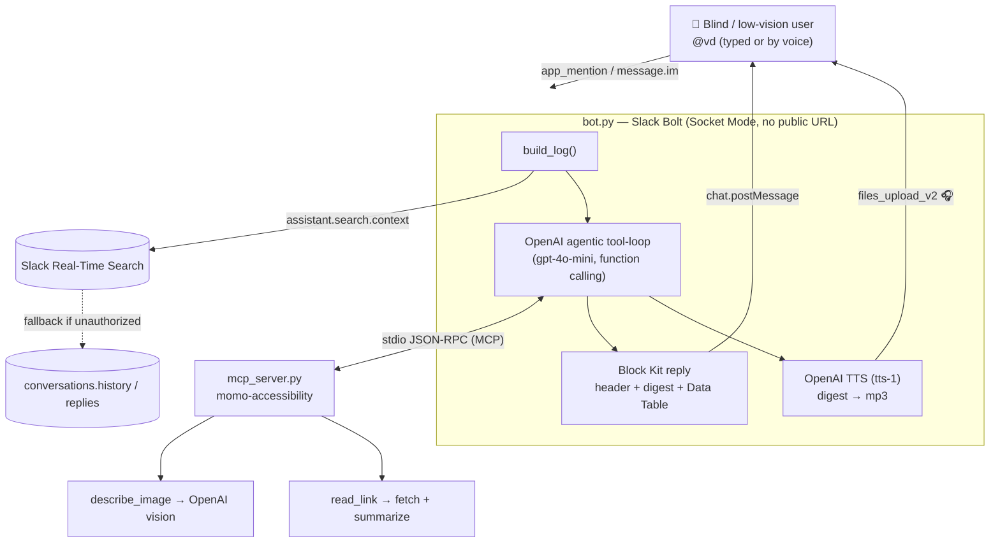

# VoiceDigest — Architecture

**One-line:** a Slack accessibility agent that turns a channel/thread into a spoken,
actionable digest for blind and low-vision users — agentic (MCP tool-loop), grounded
(Real-Time Search), and structured (Block Kit Data Table) — with a playable audio reply.

## Diagram

## Required-technology mapping (hackathon eligibility)

| Slack-promoted tech | How VoiceDigest uses it |
|---|---|
| **MCP server integration** (required) | Ships its own reusable MCP server `momo-accessibility` (stdio JSON-RPC); the bot is the MCP client and exposes the server's `tools/list` to the model as function declarations. |
| **Real-Time Search API** | `assistant.search.context` grounds the digest in fresh cross-channel context; transparent fallback to `conversations.history` keeps it working in any workspace. |
| **New Block Kit component** | To-do list renders as a **Data Table** (graceful fallback to checkboxes on unsupported workspaces). |
| **Slack AI-adjacent** | Audio-first output: digest posted as a playable clip (OpenAI TTS) so the workflow is usable entirely by ear. |

## Key properties

- **Agentic, not scripted.** The model decides when to call `describe_image` / `read_link`; the code no longer hard-codes tool calls.
- **Degrades gracefully everywhere.** RTS, the Data Table block, and TTS each fall back silently — the core digest always works, even offline of those features.
- **No public URL / no DB.** Socket Mode + Python stdlib + `slack_bolt`; single LLM key (`OPENAI_API_KEY`) covers reasoning, vision, and voice.
- **Accessibility-first.** Screen-reader-optimized text (no raw URLs/IDs, conclusion-first), plus real audio for users who don't run a screen reader.

## Files

- `src/bot.py` — Bolt bot: RTS/history → agentic OpenAI tool-loop → Block Kit + audio.
- `src/mcp_server.py` — the `momo-accessibility` MCP server (`describe_image`, `read_link`).
- `src/mcp_client.py` — minimal stdio MCP client.
- `demo/demo.html` — self-contained animated demo (real in-browser TTS) = the video basis.
